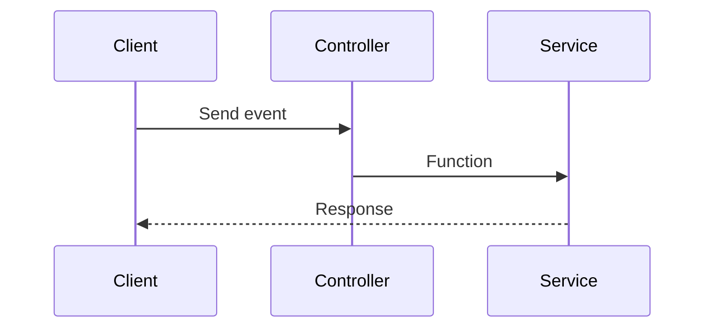

# PhoneParser

The `PhoneParser` Service can translate the 9-digit keyboard into the alphabet (a-z).

## Flowchart

- `Event`: can be described as a artisan command, or a route call
- `Function`: can be described as executing the `PhoneParser::number` or `PhoneParse::text` function



## Usage

### Commands

```bash
php artisan parse:text <input>
```

```bash
php artisan parse:number <input>
```

### API

**1. `GET` Parse a text input to the number version**

```
<url>/api/parse/text/<input>
```

**2. `GET` Parse a number input to the text version**

```
<url>/api/parse/number/<input>
```

### Facades

```php
use PhoneParser;
```

**Example 1**

Parse a text input to the number version

```php
use PhoneParser;

$output = PhoneParser::text('example'); // Output: 339926755533
```

**Example 2**

Parse a number input to the text version

```php
use PhoneParser;

$output = PhoneParser::number('339926755533'); // Output: example
```
